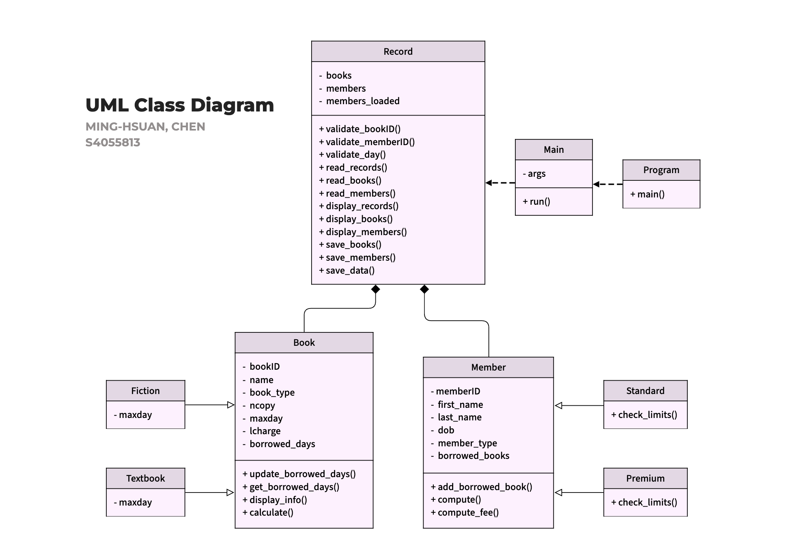
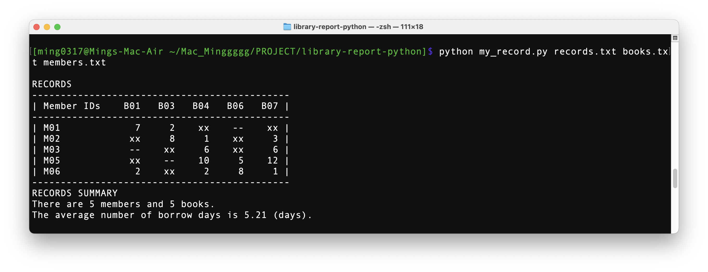
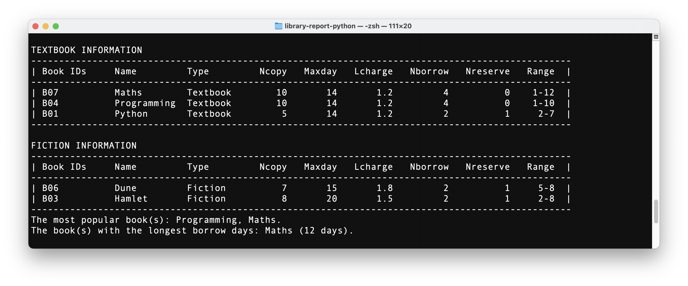
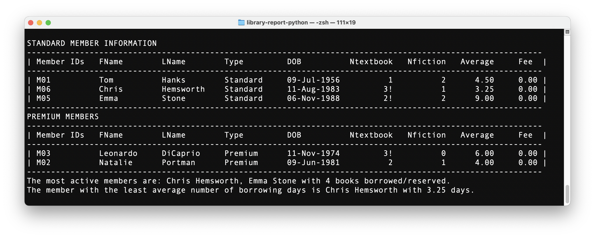
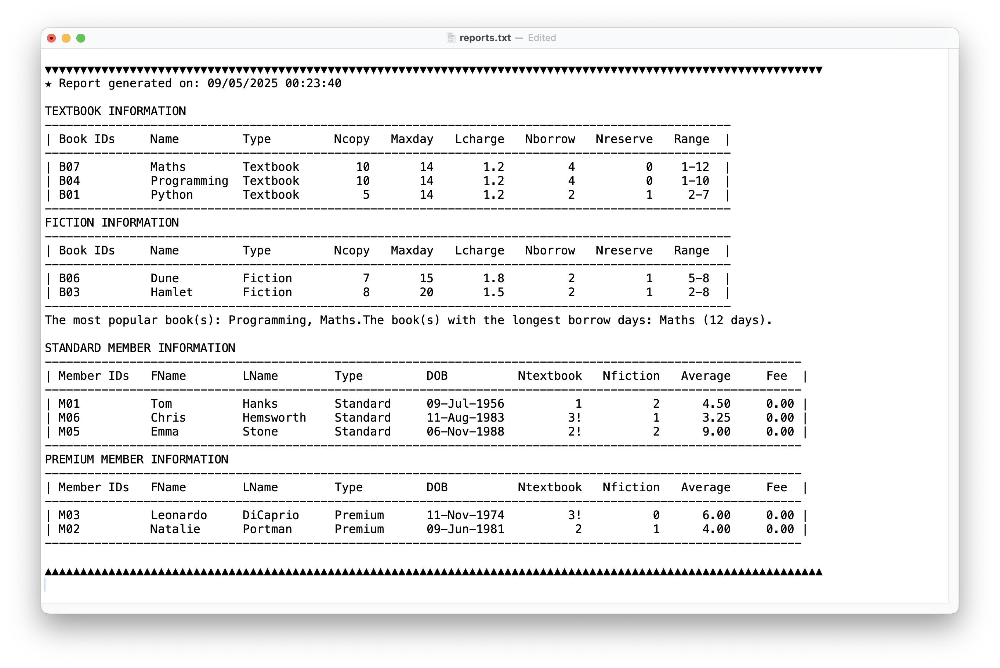

# Library Report System<br>Python OOP

A command-line library Report tool built with Python using object-oriented programming (OOP).
It supports record processing, book/member data analysis, and generates structured reports with file output.

---

## 🔧 Tech Stack

- Python 3
- Object-Oriented Programming (OOP)
- File I/O (TXT)
- Custom Exceptions
- Command-Line Interface (CLI)
- Class Diagram (UML)

---

## 📚 Key Features

- Process book borrowing records from `records.txt`
- Analyze detailed book info from `books.txt` (copies, late fees, type)
- Evaluate member activity from `members.txt` (type, DOB, borrowing behavior)
- Categorize books (Textbook vs Fiction) and members (Standard vs Premium)
- Detect rule violations (e.g. exceeded borrow limits)
- Calculate and display late fees
- Generate multi-section reports with:
  - Borrowing statistics
  - Reservation counts
  - Borrowing range
  - Most popular book / most active member
- Output report to `reports.txt` with timestamp (appends chronologically)

---

## 🗺️ Class Diagram



---

## ▶️ How to Run

You can run the program via terminal using different file inputs based on the level you want to test.

### 🔹 Option 1: records only

```bash
python my_record.py records.txt
```

### 🔹 Option 2: records + books

```bash
python my_record.py records.txt books.txt
```

### 🔹 Option 3: records + books + members

```bash
python my_record.py records.txt books.txt members.txt
```

📌 File names can be changed, but the order must be:
`records → books → members`

📄 Every time the program runs, a new report is generated and appended to reports.txt with a timestamp.

---

## 📸 Screenshots

### Display Records


### Display Books


### Display members


### Automatically generates formatted reports.txt


---

## 📂 Example Files

| File         | Purpose                    |
|--------------|----------------------------|
| `records.txt` | Book borrow & reserve log |
| `books.txt`   | Book metadata & rules     |
| `members.txt` | Member type & profile     |
| `reports.txt` | Generated report log with all tables and summaries |

You can modify these `.txt` files to test different conditions or edge cases.

---

## 🧠 What I Learned

- Built a multi-class system applying OOP best practices
- Handled nested data relationships across entities (books ⇄ members)
- Managed conditional logic with class-specific constraints
- Applied string formatting and CLI alignment techniques
- Practiced exception handling and defensive programming

---

## 🖼️ Class Diagram

📌 Included in project as `Class_Diagram.png`

---

## 📬 Contact

If you have any questions about the project or want to connect, feel free to reach out:

- GitHub: [github.com/minghsuan0317](https://github.com/minghsuan0317)
- LinkedIn: [linkedin.com/in/ming-hsuan-chen](https://www.linkedin.com/in/ming-hsuan-chen)
---

> **Note:** <br>This project was originally created for an **Programming Fundamentals** course at **RMIT** University, and all features were entirely designed and built by me.
>
